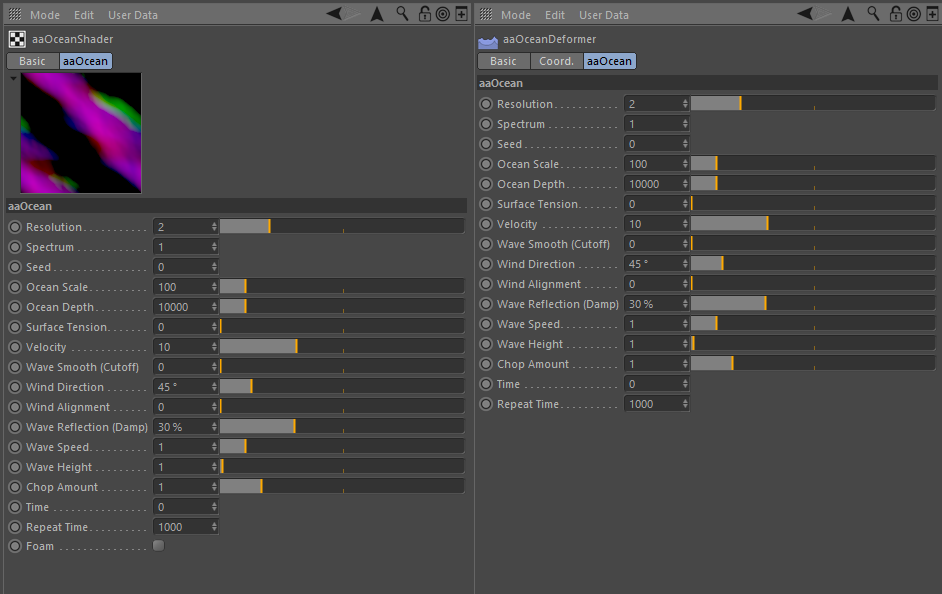

# aaOceanC4D

aaOcean Shader and Deformer by [Amaan Akram][0], ported to Cinema 4D by
[Niklas Rosenstein][2].

## Installation

* Download a build from the [Releases] page that matches your OS
  and Cinema 4D version
* Unpack the downloaded ZIP archive into your Cinema 4D plugins directory

## Build Instructions

* Install [Craftr]
* Clone the repository in the Cinema 4D application plugins directory
* `>_ git submodules update --init`
* `>_ craftr export`
* `>_ craftr build`

## Todolist/Ideas

* [ ] Shader/Deformer with on-demand wave sampling (no texture precomputation)
* [ ] OpenMP support on OSX (need to comment out `#include <omp.h>` in aaOceanClass.cpp)

## Honorable Mentions

* Amaan Akram for the [aaOcean Suite] and its source code
* Sponsor for initial port [Partner Ship Design GmbH][1]

[Releases]: https://github.com/NiklasRosenstein/c4d-aaOcean/releases
[Craftr]: https://craftr.net
[aaOcean Suite]: http://www.amaanakram.com/plugins-shaders/aaocean-suite/
[0]: http://www.amaanakram.com/
[1]: http://www.psd.de/
[2]: http://niklasrosenstein.com/
